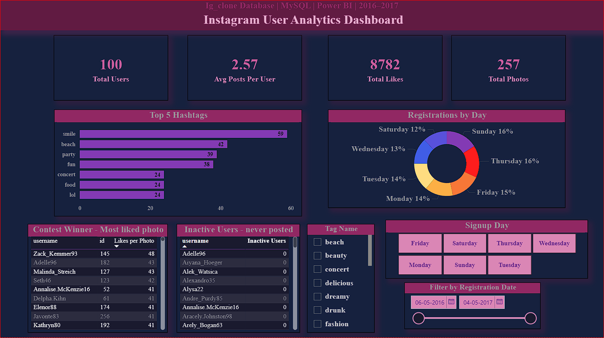
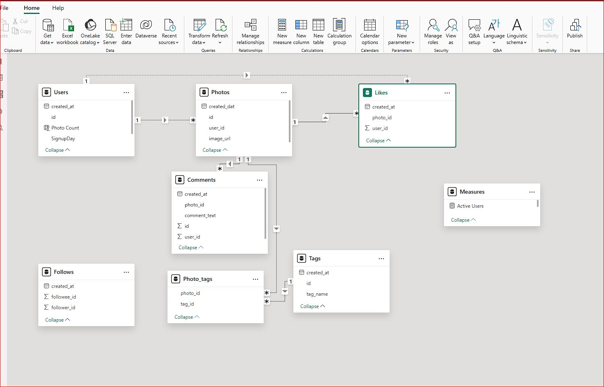

<div align="center">


[](https://powerbi.microsoft.com/)
[](https://www.mysql.com/)
[]()


</div>

---

# 📸 Instagram User Analytics Dashboard

> *Analyzing Instagram user behavior, engagement patterns, and platform health using MySQL and Power BI.*

---
## Table of contents 

- <a href="#overview">Overview</a>
- <a href="#repository-structure">Repository Structure</a>
- <a href="#problem-statement">Problem Statement</a>
- <a href="#dataset">Dataset</a>
- <a href="#tools-and-technologies">Tools and Technologies</a>
- <a href="#methods">Methods</a>
- <a href="#key-insights">Key Insights</a>
- <a href="data-model--dashboard">Data Model & Dashboard</a>
- <a href="how-to-run-this-project">How to Run This Project</a>
- <a href="results-and-conclusion">Results and Conclusion</a>
- <a href="future-work">Future Work</a>
- <a href="author">Author</a>

---
<h2><a class="anchor" id="overview"></a>Overview</h2>

This is an end-to-end data analytics project built on a simulated Instagram clone database (`ig_clone`).
Raw data was extracted and queried using **MySQL**, modeled and measured using **DAX**, and
visualized through an interactive **Power BI** dashboard styled with a custom Instagram dark theme.

The project covers the complete analytics pipeline:

Raw MySQL Data → SQL Queries → Power BI Connection
→ Data Cleaning → Data Modeling → DAX Measures
→ Dashboard Visuals → Business Insights

---

<h2><a class="anchor" id="repository-structure"></a>Repository Structure</h2>

```
📦 Instagram-User-Analytics
│
├── 📄 README.md
├── 📄 Instagram-User-Analytics.pdf
│
├── 📁 SQL/
│   └── 📄 Instagram-User-Analytics.sql
│
├── 📁 Dashboard/
│   └── 📄 Instagram_Analytics.pbix
│
├── 📁 Screenshots/
│   ├── 🖼️ dashboard_overview.jpg
│   ├── 🖼️ hashtags_chart.jpg
│   ├── 🖼️ inactive_users.jpg
│   └── 🖼️ data_model.jpg
│
└── 📁 Theme/
    └── 📄 instagram_theme.json
```

---

<h2><a class="anchor" id="problem-statement"></a>Problem Statement</h2>

Social media platforms generate massive volumes of user data every day.
Without proper analysis, this data offers little value to decision-makers.

This project addresses the following key business questions:

- 📅 Which day of the week sees the **most new registrations**?
- 🏆 Which photo received the **highest number of likes** (contest winner)?
- 👻 Which users **never posted** a single photo (inactive users)?
- 🤖 Which accounts show **bot-like behavior** (liked every photo)?
- 🏷️ What are the **top 5 most-used hashtags** on the platform?
- 👑 Who are the **5 oldest / most loyal users**?
- 📈 What is the **average number of posts** per user?

---

<h2><a class="anchor" id="dataset"></a>Dataset</h2>

| Property | Details |
|----------|---------|
| Database | `ig_clone` (MySQL) |
| Source | Simulated Instagram Clone |
| Period | May 2016 – May 2017 |
| Total Tables | 7 |

### Table Summary

| Table | Rows | Description |
|-------|:----:|-------------|
| `users` | 100 | Registered user accounts |
| `photos` | 257 | Photos posted by users |
| `likes` | 8,782 | Like events on photos |
| `comments` | ~7,000 | Comments on photos |
| `follows` | ~7,600 | Follower relationships |
| `tags` | 21 | Unique hashtag names |
| `phototags` | ~500 | Photo-to-hashtag mapping |

---

<h2><a class="anchor" id="tools-and-technologies"></a>Tools and Technologies</h2>

| Tool | Purpose |
|------|---------|
| MySQL 8.0 | Database creation, schema design, SQL queries |
| MySQL Workbench | Query execution, ER diagram visualization |
| Power BI Desktop | Data modeling, DAX measures, dashboard design |
| DAX | Calculated columns and KPI measures |
| Power Query | Data cleaning and type formatting |
| Custom JSON Theme | Instagram-style dark theme for Power BI |
| GitHub | Version control and portfolio hosting |

---

<h2><a class="anchor" id="methods"></a>Methods</h2>

### 1. Data Extraction (MySQL)
- Executed `.sql` script in MySQL Workbench to create and populate `igclone` database
- Wrote targeted SQL queries using `JOIN`, `GROUP BY`, `HAVING`, `LEFT JOIN`, `LIMIT`
- Validated row counts across all 7 tables before importing

### 2. Data Connection (Power BI)
- Connected Power BI Desktop to MySQL via `localhost:3306`
- Imported all 7 tables using MySQL Connector/NET 8.0.33
- Used **Import mode** for best performance

### 3. Data Cleaning (Power Query)
- Fixed data types: `created_at` → Date/Time, `id` columns → Whole Number
- Added custom column `SignupDay` using `Date.DayOfWeekName()`
- Corrected column name typo (`createddat` → `created_at` in photos table)

### 4. Data Modeling
Relationships created in Model View:

users[id] → photos[user_id] (One to Many — Active)
photos[id] → likes[photo_id] (One to Many — Active)
photos[id] → comments[photo_id] (One to Many — Active)
photos[id] → phototags[photo_id] (One to Many — Active)
tags[id] → phototags[tag_id] (One to Many — Active)
users[id] → likes[user_id] (One to Many — Active)
users[id] → comments[user_id] (One to Many — Inactive)


### 5. DAX Measures
```dax
Total Users     = COUNTROWS(users)
Total Photos    = COUNTROWS(photos)
Total Likes     = COUNTROWS(likes)
Avg Posts/User  = DIVIDE([Total Photos], [Total Users], 0)
Hashtag Usage   = COUNTROWS(phototags)
Likes Per Photo = COUNTROWS(likes)
Photo Count     = CALCULATE(COUNTROWS(photos),
                    FILTER(photos, photos[user_id] = users[id]))
```
### 6. Dashboard Design
- Applied custom Instagram-style dark theme via JSON file
- Built KPI cards, bar chart, donut chart, and interactive tables
- Added 3 slicers: Signup Day, Hashtag Name, Registration Date range


---

<h2><a class="anchor" id="key-insights"></a>Key Insights</h2>

### Insight	Value
- Most popular signup day	Thursday (16%)
- Users who never posted	26 inactive users
- Most liked photo	ZackKemmer93 · Photo 145 · 48 likes
- Top hashtag	#smile (59 uses)
- Avg posts per user	2.57 posts
- Bot accounts detected (SQL)	13 accounts (13%)
- Total platform likes	8,782 likes

---

<h2><a class="anchor" id="data-model--dashboard"></a>Data Model & Dashboard</h2>

- Dashboard — Executive Overview


- Data Model


---

 ### Visuals included:

🔢 KPI Cards — Total Users, Total Photos, Avg Posts/User, Total Likes

📊 Horizontal Bar Chart — Top 5 Hashtags by usage

🍩 Donut Chart — Registrations by Day of Week

🏆 Table — Contest Winner (most liked photo)

👻 Table — Inactive Users (never posted)

### Interactive Slicers:

📅 Filter by Signup Day (tile buttons)

🏷️ Filter by Hashtag (dropdown)

📆 Filter by Registration Date (date range slider)

---

<h2><a class="anchor" id="how-to-run-this-project"></a>How to Run This Project</h2>

Step-by-Step

Step 1 — Clone the Repository

git clone [https://github.com/rushishejul/Instagram-User-Analytics.git](https://github.com/rushishejul/instagram-user-analysis-sql-powerbi)
cd-Instagram-User-Analytics

Step 2 — Set Up the Database

1. Open MySQL Workbench
2. File → Open SQL Script → SQL/Instagram-User-Analytics.sql
3. Click Execute ⚡
4. Verify: USE igclone; SELECT COUNT(*) FROM users; → 100

Step 3 — Open Power BI

1. Open: Dashboard/Instagram_Analytics.pbix
2. Home → Transform Data → Data Source Settings
3. Update: Server = localhost:3306 | Database = igclone
4. Enter MySQL credentials → Connect

Step 4 — Apply Theme

View → Themes → Browse for themes
→ Select: Theme/instagram_theme.json → Open

Step 5 — Refresh

Home → Refresh → Dashboard loads with live data ✅

---

<h2><a class="anchor" id="results-and-conclusion"></a>Results and Conclusion</h2>

The dashboard successfully answers all 7 business questions with accurate, verified data:

- Marketing teams can target Thursday for new user campaigns

- Content teams should focus on #smile, #beach, #party hashtags

- Growth teams can re-engage 26 inactive users through email/push campaigns

- Management can track platform health via 2.57 avg posts/user and 8,782 total likes

This project demonstrates a complete analytics workflow — from raw relational database to
executive-ready Power BI dashboard — validating skills in SQL, data modeling, DAX, and
data storytelling.

---

<h2><a class="anchor" id="future-work"></a>Future Work</h2>
 
 - Add Page 2: Bot Detection with gauge chart and bot accounts table
 - Build follower growth trend visual using the follows table
 - Integrate comment sentiment analysis using Python + NLP
 - Add time-series analysis — likes and posts by month
 - Connect to live MySQL database with scheduled refresh
 - Publish to Power BI Service for cloud-based sharing
 - Add drill-through pages — click username → view their full profile stats


---
<h2><a class="anchor" id="author"></a>Author</h2>

### **Rushikesh Shejul**
Data Analyst | Proficient in SQL, R, Python, Gen AI, Excel, Power BI, Tableau, Azure, ETL/ELT & Snowflake
- 📍 Pune, Maharashtra, India
- 📧 Email: shejulrushi93@gmail.com
- 🔗 [LinkedIn](https://linkedin.com/in/rushikeshshejul) | 💻 [GitHub](https://github.com/rushishejul)


---


